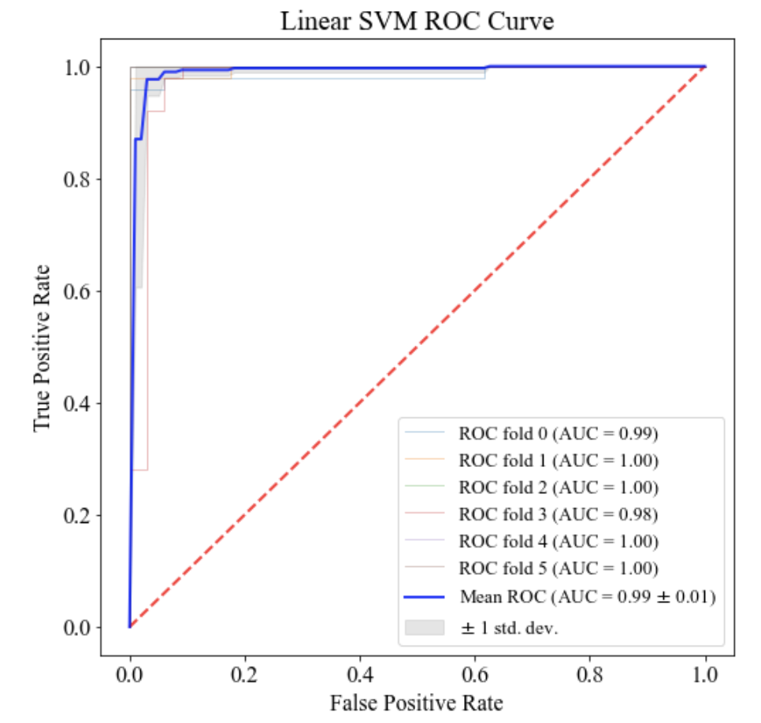

# epilepsy_id
Classifying non-seizure and seizure data from EEG Data

## Data source
The University of Bonn dataset was used for training and validation:

Andrzejak RG, Lehnertz K, Rieke C, Mormann F, David P, Elger CE (2001) Indications of nonlinear deterministic and finite dimensional structures in time series of brain electrical activity: Dependence on recording region and brain state, *Phys. Rev. E, 64, 061907*

* Dataset can be downloaded at: http://epileptologie-bonn.de/cms/front_content.php?idcat=193&lang=3

* The model trained is on non-seizure (set A and set B) and seizure data (setC, setD, setE)

## Extracted EEG Features
* Shannon Entropy
* Spectral Entropy
* Permutation Entropy
* Average power in Delta Band
* Average power in Theta Band

## Linear SVM Classifier
A linear SVM trained was fitted and trained using 6-fold cross validation. The AUC for each fold was calculated, along with the mean. 

